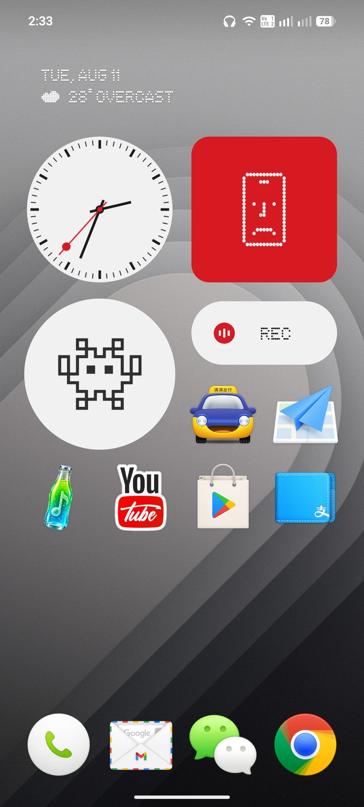

# CraftEcho Icons

> 匠心留下的回响。

<p align="center">
  
</p>

CraftEcho Icons 是一套面向 Android 启动器的非官方图标包，整理并适配了
Smartisan OS 经典的拟物图标设计。项目希望让这些细腻、有温度的数字器物在新设备上继续被使用和看见。

CraftEcho Icons is an unofficial Android icon pack preserving and adapting the
skeuomorphic icon language associated with Smartisan OS.

## 项目状态

- 收录约 1,900 个 drawable 资源
- 包含常见 Android 应用的 launcher component 映射
- 基于 [Blueprint](https://github.com/jahirfiquitiva/Blueprint) 图标包框架
- 最低支持 Android 5.0（API 21）

项目仍处于整理阶段。部分图标的名称、应用映射和视觉一致性尚待校对。

## 构建

准备 JDK 17 和 Android SDK Platform 36，然后运行：

```bash
./gradlew assembleDebug
```

生成的 APK 位于：

```text
app/build/outputs/apk/debug/com.bytemyth.craftecho.icons-1.0.0-debug.apk
```

正式发布前，请配置 release signing，并检查
`app/src/main/res/values/blueprint_setup.xml` 中的联系邮箱。

## 参与贡献

欢迎修正应用映射、图标名称和工程问题。提交前请阅读
[CONTRIBUTING.md](CONTRIBUTING.md)。新增或替换图标时，请确保你有权提交和分发相关素材。

## 名称与版权

CraftEcho Icons 是独立的非官方项目，与锤子科技、Smartisan 或相关权利人没有隶属、赞助或背书关系。
“Smartisan”及相关名称和标识属于各自权利人。

本仓库中的应用代码基于 Blueprint，其许可条款见 [LICENSE.md](LICENSE.md)。图标素材及第三方商标不因代码公开而自动获得相同许可；详情请阅读 [ASSET_RIGHTS.md](ASSET_RIGHTS.md)。

## 致谢

- Smartisan OS 的设计师们，感谢他们创造了这套令人难忘的视觉语言
- [Jahir Fiquitiva](https://github.com/jahirfiquitiva) 与 Blueprint 项目贡献者
